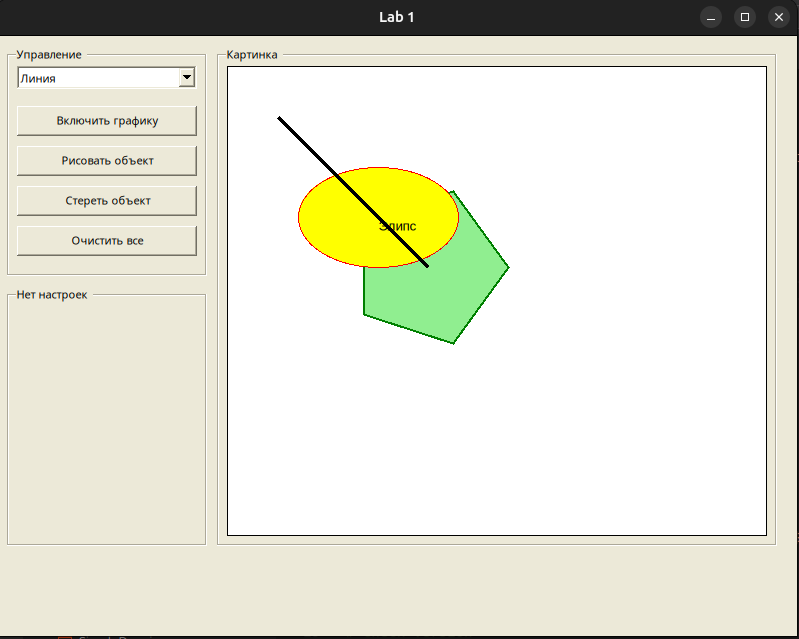

-— Задание 01 —-

Рисование простых фигур (на базовом языке программирования)

Создать классы, имеющие, как минимум два метода: рисования и стирания.
1) линии (свойства: толщина; цвет; тип линии - например сплошная или пунктирная; вид начала и окончания линии - например круг или стрелка);
Свойства, связанные с началом и окончанием линии (круг, стрелка и т.д.), и для
типа линии (сплошная, пунктирная и т.д.) можно задать в свойствах объекта Pen (StartCap, EndCap), для типа линии (DashStyle).
Их виды (круг, стрелка, тип линии) можно найти в System.Drawing.Drawing2d.
В классе линии задаются: начало и конец линии, ширина линии, цвета - основной и фона (для линии).

2) закрашенный эллипс и подписанный эллипс (в общем случае имеем разные цвета - для контура (функция DrawEllipse) и заливки (функция FillEllipse),
а также цвет фона для стирания. Круг это частный случай эллипса, когда радиусы по Х и по Y равны.
Задать в классе центр круга, радиусы и цвета). В функции заполнения для задания цвета можно вместо объекта Pen использовать объект SolidBrush;
Научиться подписывать фигуру, используя метод DrawString для отображения текста (в методе задаются цвет, фонт и координаты начала текста).
Для класса Эллипс задаются: координаты центра и два радиуса (для эллипса), массив точек (для произвольного многоугольника).
Рисование в функции DrawEllipse идет о левого верхнего угла, поэтому надо из центра вычесть радиус.

3) многоугольник:
а) произвольный (по заданным точкам) и
б) правильный (например пятиугольник (звезда), шестиугольник и т.д.

Для класса Многоугольник задаются: координаты центра, количество сторон правильного многоугольника, и другие характеристики (толщина линии контура фигуры,
цвет контура и цвет внутренней закраски, цвет фона).
Характеристики могут задаваться по умолчанию в конструкторе класса, передачей параметров в функции рисования и стирания
(стирать - это рисовать объект еще раз, но цветом фона), вводом в элементы ввода на форме.
В методе класса стирается только один сам этот объект.

Для правильного многоугольника задается число его граней = n).
Считается базовый угол = 2 * PI/n.
Дальше в цикле он умножается на i.

Для произвольного многоугольника можно создать компонент listBox и кнопку "Добавить точку".

int count=0; //число точек многоугольника
button_add () {
int x=0,y=0;
x= взять из textBox
y=
listBox1.Items.Add(x.ToString()+" "+y.ToString());
count=listBox1.Items.Count;
}

В кнопке рисования многоугольника можно объявить массив:
PointF [] points=new PointF[count];

Заполнить его в цикле из listBox, например так:
string s="";
string [] a=new string[2];
for(int i=0;i<n;i++)
{
s=listBox1.Items[i].ToString();
a=s.Split(' '); //разделитель - пробел, разделяем правую и левую часть в строке listBox
points[i]=new PointF(Convert.ToInt16(a[0]),Convert.ToInt16(a[1]));
}

Далее массив points отправляется в функции DrawPolygon и FillPolygon.

Вид формы:
- для группировки элементов удобно использовать groupBox (один для кнопок, один для рисования).
- для рисования выбираем компонент pictureBox или panel. В свойстве BorderStyle можно задать рамку.
- Три кнопки "Включить графику", "Рисовать объект", "Стереть объект".
- Для ввода данных с формы используются несколько textBox.
Например:
int x=0;
if (textBox1.Text!="") x=Convert.ToInt16(textBox1.Text); //если данный textBox не пуст, то взять значение из него

Для очистки всей области рисования проще использовать отдельную кнопку "Очистить все",
где в FillRectangle заполнять всю область рисования
(c размерами 0, 0, pictureBox1.Widht, pictureBox1.Height) цветом фона.