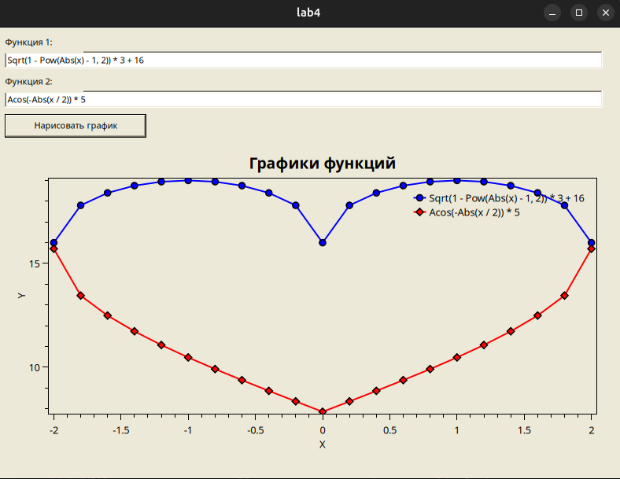

-— Задание 03 —-

Построить график заданной функции.

Для построения графиков в C# например имеется компонент Chart.Требуется освоить этот компонент.На форму помещается компонент Visual C# под названием chart. Он предназначен для рисования графиков.Пример работы с этим компонентом есть по ссылке https://www.youtube.com/watch?v=y8sEeIQUfAI

Там можно установить отметки по осям, выбрать вид графика и т.д.

Ввести с формы формулы двух или более функций,превратить их в формулы (пропарсить) в программе инарисовать для них одновременно два разных графика.

Для парсинга введенной формулы можно например через nuget скачать библиотеку ncalc.

Нарисовать и подписать оси и т.д.На графиках задать метки, (квадратики, треугольники, круги и т.п. в точках графика).Для меток есть свойство (у series) MarkerStyle.

Поиграться с разными типами графиков.
