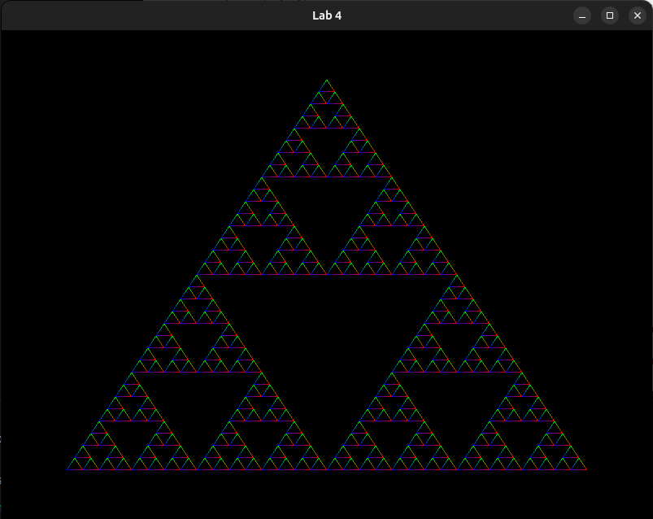

-— Задание 04 —-

Изобразить фрактал (базовый язык программирования или в opengl)

Нарисовать (средствами языка программирования) фрактал:заданный преподавателем или выбранный самостоятельно и одобренный преподавателем.

В качестве более сложного задания можно попытаться нарисовать фрактал в 3D.Выполнить на openGL.p.s. 

Вид фрактала взять из главы 4 книги Аммерала(см. файл "Примеры фракталов на C"). Пример с драконом,который вам давали в он-лайн курсе (первый курс) С# показывать не надо.
