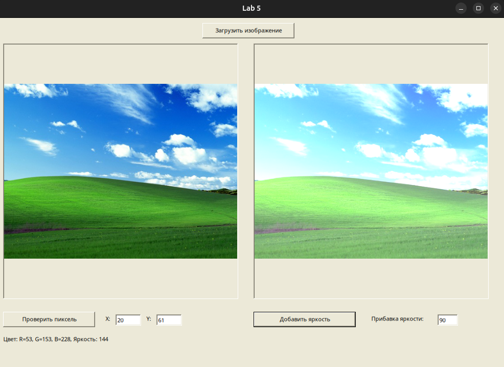

-— Задание 05 —-

Работа с BitMap изображением (базовый язык программирования)

Загрузить в программу какое-либо изображение (в формате bmp, jpg и т.д.), которое можно рассматривать как некоторый входной поток.

Отобразить его на экране Windows Forms (например в компоненте pictureBox).

Для каждого пиксела изображения определить его цвет и яркость. Результаты можно вывестиследующими способами:
- в двумерную таблицу, заданную в программе компонентом dataGridView. Строки и столбцы таблицы соответствуют координат пикселов изображения.
- в компонент ListBox.
- при указании координат пиксела.Так как в изображении много пикселов, то не обязательно выводить все. Можно указать диапазоны: с какого по какой по оси X и Y.

Изменить значения цветов в таблице по какому-либо собственному алгоритму.Отобразить модифицированное изображение на экране Windows Forms (например в еще одном компоненте pictureBox).
